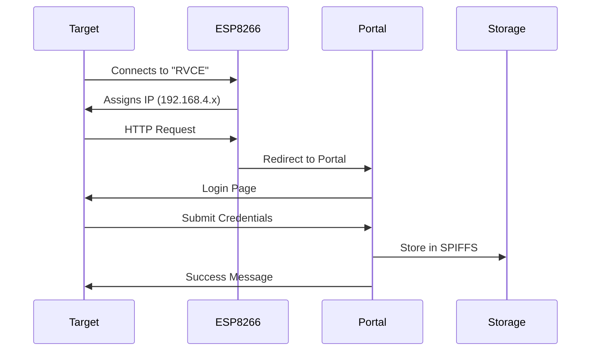
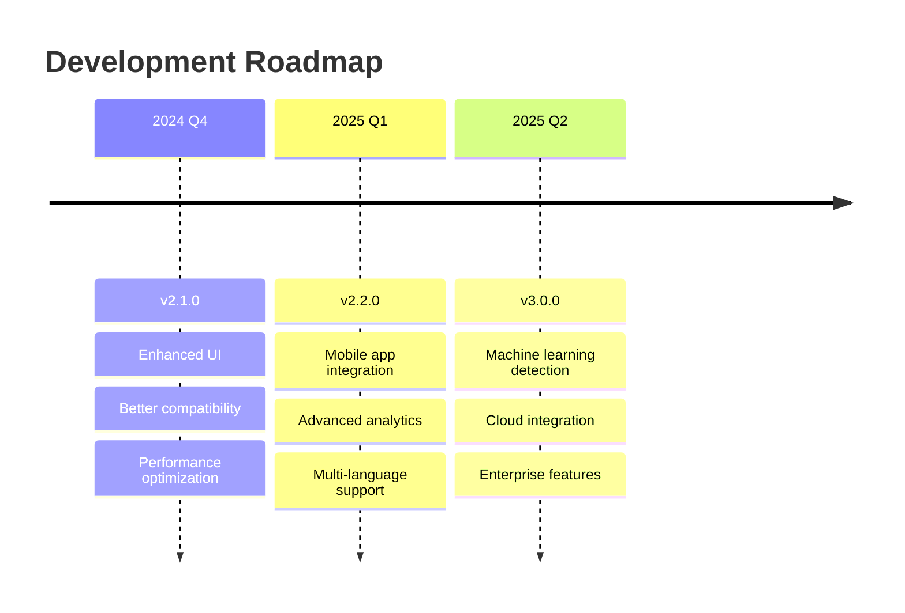

<div align="center">

# 🌐 ESP8266 Captive Portal Attack


**A sophisticated captive portal implementation for cybersecurity education and authorized penetration testing**

[🚀 Quick Start](#-quick-start) • [📚 Documentation](#-documentation) • [🔧 Installation](#-installation) • [⚖️ Legal](#-legal-disclaimer) • [🤝 Contributing](#-contributing)

</div>

---

## 🎯 Project Overview

<details>
<summary><b>📖 What is this project?</b></summary>

This project demonstrates a **captive portal attack** using the ESP8266 NodeMCU microcontroller. It creates a convincing fake WiFi access point that automatically redirects users to an authentication page designed to harvest credentials for educational and authorized security testing purposes.

**Key Educational Value:**
- Understanding WiFi security vulnerabilities
- Learning about social engineering techniques
- Practicing defensive cybersecurity measures
- Demonstrating the importance of network verification

</details>

<details>
<summary><b>⚠️ Important Security Notice</b></summary>

> **🛡️ FOR EDUCATIONAL USE ONLY**
> 
> This tool is designed exclusively for:
> - Authorized penetration testing
> - Cybersecurity education and training
> - Security awareness demonstrations
> - Learning about WiFi vulnerabilities
> 
> **Unauthorized use is illegal and unethical.**

</details>

## ✨ Features & Capabilities

<table>
<tr>
<td width="50%">

### 🔥 Core Features
- ✅ **Fake Access Point** with MAC spoofing
- ✅ **Auto-redirect Captive Portal**
- ✅ **Cross-platform Detection** (iOS/Android/Windows)
- ✅ **Real-time Credential Capture**
- ✅ **Persistent SPIFFS Storage**
- ✅ **Responsive Web Interface**
- ✅ **Serial Monitor Integration**

</td>
<td width="50%">

### 🛠️ Technical Specs
- ⚡ **ESP8266** 80MHz processor
- 🔌 **802.11 b/g/n** WiFi support
- 💾 **4MB Flash** memory
- 🌐 **HTTP/DNS** server capabilities
- 📱 **Mobile-optimized** UI
- 🔒 **WPA2** network emulation
- 📊 **Real-time** monitoring

</td>
</tr>
</table>

## 🏗️ Architecture & Technology Stack

<div align="center">

```mermaid
graph TD
    A[Target Device] -->|Connects to| B[ESP8266 Fake AP]
    B -->|DNS Redirect| C[Captive Portal]
    C -->|User Input| D[Credential Capture]
    D -->|Storage| E[SPIFFS File System]
    D -->|Monitor| F[Serial Output]
    E -->|Web Access| G[/logs Endpoint]
```

</div>

### 📦 Dependencies & Libraries

<div align="center">

| Component | Version | Purpose | Documentation |
|-----------|---------|---------|---------------|
|  | `3.1.2+` | WiFi AP Management | [📖 Docs](https://arduino-esp8266.readthedocs.io/en/latest/esp8266wifi/readme.html) |
|  | `1.0+` | HTTP Server | [📖 Docs](https://github.com/esp8266/Arduino/tree/master/libraries/ESP8266WebServer) |
|  | `1.1.1+` | DNS Redirection | [📖 Docs](https://github.com/esp8266/Arduino/tree/master/libraries/DNSServer) |
|  | `0.5.0+` | File System | [📖 Docs](https://arduino-esp8266.readthedocs.io/en/latest/filesystem.html) |

</div>

## 🚀 Quick Start

### Prerequisites Checklist

- [ ] **ESP8266 NodeMCU** development board
- [ ] **Arduino IDE** (v1.8.19+ or v2.0+)
- [ ] **USB Cable** (Micro-USB to USB-A)
- [ ] **Computer** with admin privileges

### ⚡ One-Click Setup

<details>
<summary><b>🔧 Automated Installation Script</b></summary>

**For Windows (PowerShell):**
```powershell
# Download and run the setup script
Invoke-WebRequest -Uri "https://raw.githubusercontent.com/Prateek-glitch/esp8266-captive-portal/main/setup.ps1" -OutFile "setup.ps1"
.\setup.ps1
```

**For macOS/Linux (Bash):**
```bash
# Download and run the setup script
curl -sSL https://raw.githubusercontent.com/Prateek-glitch/esp8266-captive-portal/main/setup.sh | bash
```

</details>

### 🛠️ Manual Installation

<details>
<summary><b>Step 1: Arduino IDE Configuration</b></summary>

1. **Install Arduino IDE**
   ```
   Download from: https://www.arduino.cc/en/software
   ```

2. **Add ESP8266 Board Support**
   - Open Arduino IDE
   - Go to `File` → `Preferences`
   - Add this URL to "Additional Board Manager URLs":
     ```
     http://arduino.esp8266.com/stable/package_esp8266com_index.json
     ```
   - Go to `Tools` → `Board` → `Boards Manager`
   - Search "ESP8266" and install the package

3. **Install Required Libraries**
   - All libraries are pre-installed with ESP8266 package
   - Verify installation: `Sketch` → `Include Library`

</details>

<details>
<summary><b>Step 2: Hardware Setup</b></summary>

1. **Connect NodeMCU**
   - Use quality USB cable
   - Install CH340 drivers if needed
   - Verify connection in Device Manager

2. **Board Configuration**
   ```
   Board: NodeMCU 1.0 (ESP-12E Module)
   Upload Speed: 921600
   CPU Frequency: 80 MHz
   Flash Size: 4MB (FS:2MB OTA:~1019KB)
   Port: [Select your COM port]
   ```

</details>

<details>
<summary><b>Step 3: Code Upload</b></summary>

1. **Download Source Code**
   ```bash
   git clone https://github.com/Prateek-glitch/esp8266-captive-portal.git
   cd esp8266-captive-portal
   ```

2. **Upload to Device**
   - Open `captive_portal.ino` in Arduino IDE
   - Select correct board and port
   - Click Upload (Ctrl+U)
   - Monitor serial output at 115200 baud

</details>

## 📱 Usage Guide

### 🎮 Operation Modes

<table>
<tr>
<th>Mode</th>
<th>Description</th>
<th>Access Method</th>
</tr>
<tr>
<td>🕷️ <b>Attack Mode</b></td>
<td>Active credential harvesting</td>
<td>Connect to "RVCE" network</td>
</tr>
<tr>
<td>📊 <b>Monitor Mode</b></td>
<td>Real-time credential viewing</td>
<td>Serial Monitor (115200 baud)</td>
</tr>
<tr>
<td>🌐 <b>Web Dashboard</b></td>
<td>Browser-based log viewing</td>
<td><code>http://192.168.4.1/logs</code></td>
</tr>
</table>

### 🎯 Attack Workflow



### 📊 Monitoring & Logs

<details>
<summary><b>🖥️ Serial Monitor Output</b></summary>

```
[12:34:56] Captive Portal Ready
[12:34:56] Connect to: RVCE
[12:34:56] Then go to: http://192.168.4.1
[12:35:23] [Captured] Username: john.doe@email.com | Password: mypassword123
[12:36:15] [Captured] Username: admin | Password: admin123
```

</details>

<details>
<summary><b>🌐 Web Dashboard Features</b></summary>

- **Real-time Updates**: Auto-refresh captured credentials
- **Export Options**: Download logs as CSV/JSON
- **Statistics**: Connection attempts, success rate
- **Device Info**: Connected clients, MAC addresses

Access: `http://192.168.4.1/logs`

</details>

## 🔒 Security & Defense

### 🛡️ How to Detect This Attack

<div align="center">

| Detection Method | Description | Tools |
|------------------|-------------|-------|
| 🔍 **Network Analysis** | Monitor for duplicate SSIDs | WiFi Analyzer, Wireshark |
| 🏷️ **MAC Verification** | Check authentic network MAC | Router admin panel |
| 🔐 **Certificate Validation** | Verify SSL certificates | Browser security indicators |
| 📡 **Signal Strength** | Compare signal patterns | WiFi strength meters |

</div>

### 🔧 Defensive Measures

<details>
<summary><b>👤 For End Users</b></summary>

- ✅ **Verify network authenticity** before connecting
- ✅ **Check for HTTPS** on all login pages
- ✅ **Use VPN** on public networks
- ✅ **Enable auto-connect** only for trusted networks
- ✅ **Keep devices updated** with latest security patches

</details>

<details>
<summary><b>🏢 For Organizations</b></summary>

- ✅ **Implement WPA3** encryption
- ✅ **Use enterprise authentication** (802.1X)
- ✅ **Deploy network monitoring** tools
- ✅ **Educate users** about WiFi security
- ✅ **Regular security audits** and penetration testing

</details>

## ⚙️ Configuration

### 🔧 Customization Options

<details>
<summary><b>🌐 Network Settings</b></summary>

```cpp
// Basic Configuration
const char *ssid = "RVCE";                              // Change network name
IPAddress apIP(192, 168, 4, 1);                        // Modify IP range
const byte DNS_PORT = 53;                               // DNS port
uint8_t spoofedMAC[6] = {0xF4, 0x06, 0x69, 0x7C, 0x7C, 0x43}; // Target MAC

// Advanced Settings
#define MAX_CLIENTS 8                                   // Maximum connections
#define WIFI_CHANNEL 6                                  // WiFi channel
#define HIDDEN_NETWORK false                            // Hide SSID
```

</details>

<details>
<summary><b>🎨 Interface Customization</b></summary>

```css
/* Modify portal appearance */
:root {
  --primary-color: #2f71b2;
  --background-color: #ffffff;
  --text-color: #6a6a6a;
  --border-color: #a9a9a9;
}

/* Logo customization */
.logo {
  background: url(/logo) no-repeat center;
  background-size: contain;
  height: 100px;
}
```

</details>

### 📁 File Structure

```
esp8266-captive-portal/
├── 📄 captive_portal.ino          # Main Arduino sketch
├── 📁 data/                       # SPIFFS data directory
│   ├── 🖼️ logo.png               # Portal logo
│   └── 📝 style.css              # Additional styles
├── 📁 docs/                       # Documentation
│   ├── 📖 API.md                 # API documentation
│   ├── 🛠️ SETUP.md              # Setup guide
│   └── 🔒 SECURITY.md            # Security notes
├── 📁 scripts/                    # Automation scripts
│   ├── ⚡ setup.sh               # Linux/macOS setup
│   └── ⚡ setup.ps1              # Windows setup
├── 📄 README.md                   # This file
├── 📄 LICENSE                     # MIT license
└── 📄 CHANGELOG.md                # Version history
```

## 🧪 Testing & Validation

### ✅ Compatibility Matrix

<div align="center">

| Platform | Browser | Captive Detection | Status |
|----------|---------|-------------------|--------|
| 🤖 **Android** | Chrome | `generate_204` | ✅ Tested |
| 🍎 **iOS** | Safari | `hotspot-detect.html` | ✅ Tested |
| 🪟 **Windows** | Edge | `connecttest.txt` | ✅ Tested |
| 🐧 **Linux** | Firefox | `redirect` | ✅ Tested |
| 🍎 **macOS** | Safari | `library/test/success.html` | ✅ Tested |

</div>

### 🔬 Testing Checklist

- [ ] Device creates AP successfully
- [ ] DNS redirection works
- [ ] Captive portal triggers automatically
- [ ] Credentials are captured and stored
- [ ] Serial monitoring displays data
- [ ] Web dashboard accessible
- [ ] SPIFFS storage persistent
- [ ] Cross-platform compatibility

## 📊 Performance Metrics

<div align="center">

| Metric | Value | Description |
|--------|--------|-------------|
| ⚡ **Boot Time** | ~3 seconds | Time to full operation |
| 🔌 **Power Consumption** | ~80mA | Average current draw |
| 📡 **Range** | 50-100m | Typical WiFi range |
| 👥 **Max Clients** | 8 concurrent | Simultaneous connections |
| 💾 **Storage** | 2MB SPIFFS | Credential storage space |
| 🔄 **Response Time** | <100ms | Portal load time |

</div>

## 🐛 Troubleshooting

<details>
<summary><b>❌ Common Issues & Solutions</b></summary>

### Upload Issues
**Problem**: Can't upload code to NodeMCU
```bash
# Solutions:
1. Hold FLASH button while uploading
2. Check USB cable and drivers
3. Lower upload speed to 115200
4. Reset board before upload
```

### WiFi Issues
**Problem**: AP not visible or unstable
```cpp
// Add to setup():
WiFi.persistent(false);
WiFi.mode(WIFI_OFF);
delay(1000);
WiFi.mode(WIFI_AP);
```

### SPIFFS Issues
**Problem**: Storage not working
```cpp
// Format SPIFFS:
SPIFFS.format();
```

### DNS Issues
**Problem**: Captive portal not triggering
```cpp
// Verify DNS routes:
dnsServer.start(DNS_PORT, "*", apIP);
```

</details>

## 📈 Roadmap & Future Features

<div align="center">



</div>

### 🚀 Planned Enhancements

- [ ] **🎨 Modern UI/UX** with animations
- [ ] **📱 Mobile app** for remote monitoring
- [ ] **☁️ Cloud dashboard** integration
- [ ] **🤖 AI-powered** social engineering
- [ ] **🔍 Advanced analytics** and reporting
- [ ] **🌍 Multi-language** support
- [ ] **🔐 Enterprise** authentication bypass
- [ ] **📊 Real-time** network mapping

## 🏆 Acknowledgments

<div align="center">

### 🙏 Special Thanks

**Inspiration & References:**
- [ESP8266 Community](https://github.com/esp8266/Arduino) - Core libraries
- [WiFiManager](https://github.com/tzapu/WiFiManager) - Configuration inspiration
- [Captive Portal Research](https://github.com/topics/captive-portal) - Security research

**Security Research:**
- [@spacehuhn](https://github.com/spacehuhn) - WiFi security tools
- [@n0fate](https://github.com/n0fate) - Network security research
- [@cybersecuritybase](https://cybersecuritybase.mooc.fi/) - Educational resources

</div>

## ⚖️ Legal Disclaimer

<div align="center">

> ### 🚨 IMPORTANT LEGAL NOTICE
> 
> **This project is for educational and authorized testing purposes ONLY.**
> 
> ✅ **AUTHORIZED USES:**
> - Educational cybersecurity training
> - Authorized penetration testing
> - Security awareness demonstrations
> - Academic research with proper approval
> 
> ❌ **PROHIBITED USES:**
> - Unauthorized network access
> - Malicious credential theft
> - Any illegal activities
> - Commercial exploitation without permission
> 
> **By using this software, you agree to:**
> - Comply with all applicable laws and regulations
> - Obtain proper authorization before testing
> - Use only in controlled environments
> - Take responsibility for your actions
> 
> **The author (@Prateek-glitch) assumes no liability for misuse of this software.**

</div>

## 🤝 Contributing

<div align="center">

### 💝 Ways to Contribute

[](CONTRIBUTING.md)
[](https://github.com/Prateek-glitch/esp8266-captive-portal/issues)
[](https://github.com/Prateek-glitch/esp8266-captive-portal/pulls)

</div>

<details>
<summary><b>🛠️ Development Guidelines</b></summary>

1. **Fork** the repository
2. **Create** a feature branch:
   ```bash
   git checkout -b feature/amazing-feature
   ```
3. **Commit** your changes:
   ```bash
   git commit -m 'Add some amazing feature'
   ```
4. **Push** to the branch:
   ```bash
   git push origin feature/amazing-feature
   ```
5. **Open** a Pull Request

### 📝 Contribution Types
- 🐛 **Bug Reports** - Help us improve
- ✨ **Feature Requests** - Suggest new ideas
- 📖 **Documentation** - Improve clarity
- 🔧 **Code Improvements** - Optimize performance
- 🌍 **Translations** - Multi-language support

</details>

## 📄 License

<div align="center">

[](https://opensource.org/licenses/MIT)

This project is licensed under the **MIT License** - see the [LICENSE](LICENSE) file for details.

</div>

---

<div align="center">

### 🌟 Star this repository if you found it helpful!

[](https://github.com/Prateek-glitch/esp8266-captive-portal/stargazers)
[](https://github.com/Prateek-glitch/esp8266-captive-portal/network)
[](https://github.com/Prateek-glitch/esp8266-captive-portal/watchers)

**Made with ❤️ for cybersecurity education**

*Last updated: August 6, 2025*

</div>
