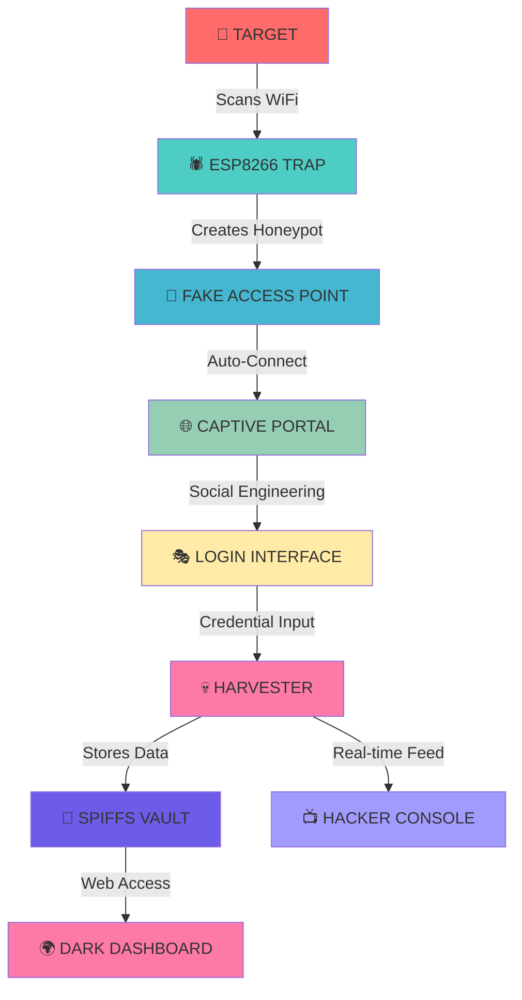
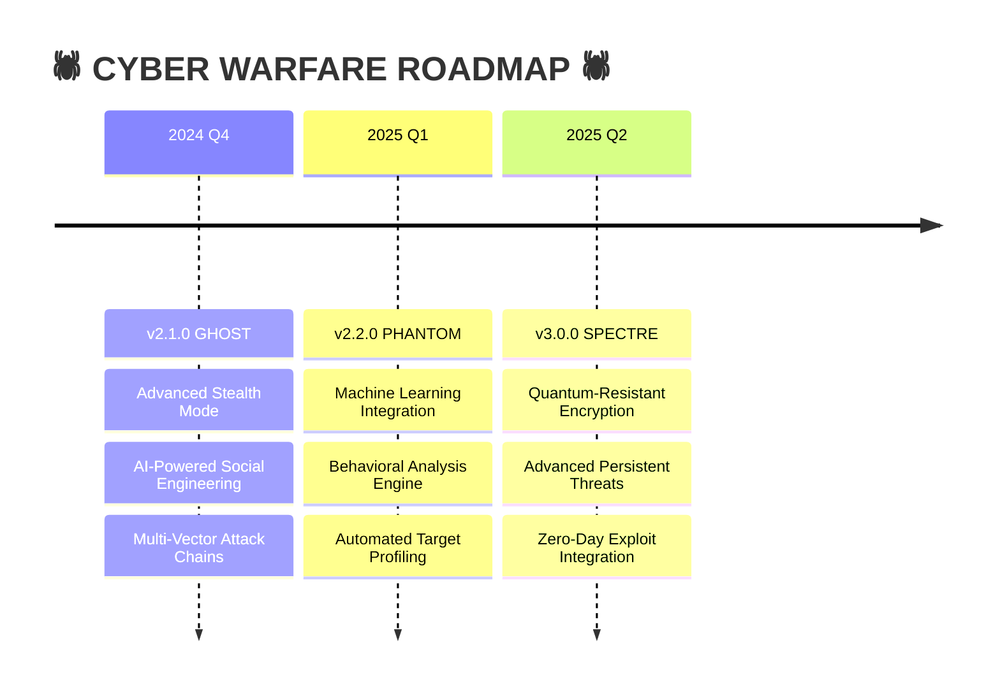

<div align="center">

# 🕷️ ESP8266 Captive Portal Attack


```
     ██████╗██╗   ██╗██████╗ ███████╗██████╗     ██████╗  ██████╗ ██████╗ ████████╗ █████╗ ██╗     
    ██╔════╝╚██╗ ██╔╝██╔══██╗██╔════╝██╔══██╗    ██╔══██╗██╔═══██╗██╔══██╗╚══██╔══╝██╔══██╗██║     
    ██║      ╚████╔╝ ██████╔╝█████╗  ██████╔╝    ██████╔╝██║   ██║██████╔╝   ██║   ███████║██║     
    ██║       ╚██╔╝  ██╔══██╗██╔══╝  ██╔══██╗    ██╔═══╝ ██║   ██║██╔══██╗   ██║   ██╔══██║██║     
    ╚██████╗   ██║   ██████╔╝███████╗██║  ██║    ██║     ╚██████╔╝██║  ██║   ██║   ██║  ██║███████╗
     ╚═════╝   ╚═╝   ╚═════╝ ╚══════╝╚═╝  ╚═╝    ╚═╝      ╚═════╝ ╚═╝  ╚═╝   ╚═╝   ╚═╝  ╚═╝╚══════╝
                                       💀 CREDENTIAL HARVESTING FRAMEWORK 💀
```


**🔥 Elite WiFi Penetration Testing Tool for Cybersecurity Warriors 🔥**


[🎯 DEPLOY ATTACK](#-deploy-attack) • [📡 MONITOR TARGETS](#-monitor-targets) • [⚡ INSTALL PAYLOAD](#-install-payload) • [🛡️ DEFENSE MATRIX](#-defense-matrix) • [💀 JOIN HACKERS](#-join-hackers)

</div>

---

## 🎯 MISSION BRIEFING

<details>
<summary><b>🕵️ CLASSIFIED: Operation Overview</b></summary>

```
[CLASSIFIED DOCUMENT - EYES ONLY]
╔══════════════════════════════════════════════════════════════════╗
║                    OPERATION: CYBER PORTAL                      ║
║                    CLASSIFICATION: EDUCATIONAL                   ║
║                    THREAT LEVEL: MODERATE                       ║
╠══════════════════════════════════════════════════════════════════╣
║                                                                  ║
║  TARGET: WiFi Infrastructure Vulnerabilities                    ║
║  METHOD: Social Engineering + Technical Exploitation            ║
║  PAYLOAD: ESP8266 Captive Portal Trojan                        ║
║  OBJECTIVE: Educational Penetration Testing                     ║
║                                                                  ║
║  WARNING: FOR AUTHORIZED PERSONNEL ONLY                         ║
║           MISUSE WILL RESULT IN LEGAL CONSEQUENCES              ║
║                                                                  ║
╚══════════════════════════════════════════════════════════════════╝
```

**🎯 Mission Objectives:**
- [x] Demonstrate WiFi security vulnerabilities
- [x] Educate about social engineering tactics
- [x] Train defensive cybersecurity measures
- [x] Expose network authentication weaknesses

</details>

<details>
<summary><b>⚠️ THREAT ASSESSMENT</b></summary>

```
┌─[CYBER-THREAT-MATRIX]─────────────────────────────────────┐
│                                                           │
│  🔴 CRITICAL: Unauthorized credential harvesting         │
│  🟠 HIGH:     Social engineering attack vector           │
│  🟡 MEDIUM:   Network infrastructure compromise          │
│  🟢 LOW:      Educational security demonstration         │
│                                                           │
│  ⚠️  DEPLOY ONLY IN CONTROLLED ENVIRONMENTS              │
│  ⚠️  OBTAIN WRITTEN AUTHORIZATION BEFORE USE             │
│  ⚠️  EDUCATIONAL PURPOSES ONLY - NO MALICIOUS USE        │
│                                                           │
└───────────────────────────────────────────────────────────┘
```

</details>

## 💀 ATTACK VECTORS & CAPABILITIES

<div align="center">

```
    ╔═══════════════════════════════════════════════════════════════╗
    ║                    🕷️ CYBER ARSENAL 🕷️                      ║
    ╠═══════════════════════════════════════════════════════════════╣
    ║  [✓] ROGUE ACCESS POINT        [✓] DNS HIJACKING            ║
    ║  [✓] MAC ADDRESS SPOOFING      [✓] CAPTIVE PORTAL INJECTION  ║
    ║  [✓] SOCIAL ENGINEERING UI     [✓] REAL-TIME MONITORING     ║
    ║  [✓] CREDENTIAL HARVESTING     [✓] STEALTH OPERATIONS       ║
    ║  [✓] CROSS-PLATFORM TARGETING [✓] PERSISTENT BACKDOOR      ║
    ╚═══════════════════════════════════════════════════════════════╝
```

</div>

<table>
<tr>
<td width="50%">

### 🔥 OFFENSIVE CAPABILITIES
```bash
$ ./cyber_portal --status
[+] PAYLOAD STATUS: ARMED
[+] TARGET ACQUISITION: ACTIVE
[+] STEALTH MODE: ENABLED
[+] BACKDOOR: PERSISTENT
[+] EXFILTRATION: READY
[+] SOCIAL ENGINEERING: DEPLOYED
```

</td>
<td width="50%">

### 🛡️ DEFENSIVE INTEL
```bash
$ ./defense_matrix --scan
[!] VULNERABILITY DETECTED
[!] CAPTIVE PORTAL ACTIVE
[!] CREDENTIAL LEAK RISK: HIGH
[!] MITIGATION: REQUIRED
[!] AWARENESS TRAINING: CRITICAL
[!] NETWORK HARDENING: NEEDED
```

</td>
</tr>
</table>

## 🏗️ CYBER WARFARE ARCHITECTURE

<div align="center">

```
                    🕷️ ATTACK FLOW DIAGRAM 🕷️
    
    ┌─────────────┐       ┌─────────────┐       ┌─────────────┐
    │   TARGET    │──────▶│  ESP8266    │──────▶│ CREDENTIAL  │
    │   DEVICE    │       │ CYBER NODE  │       │ HARVESTER   │
    └─────────────┘       └─────────────┘       └─────────────┘
           │                      │                      │
           ▼                      ▼                      ▼
    ┌─────────────┐       ┌─────────────┐       ┌─────────────┐
    │ WiFi Scan   │       │ Fake AP     │       │ SPIFFS      │
    │ Detection   │       │ Deployment  │       │ Database    │
    └─────────────┘       └─────────────┘       └─────────────┘
           │                      │                      │
           ▼                      ▼                      ▼
    ┌─────────────┐       ┌─────────────┐       ┌─────────────┐
    │ Auto-Connect│       │ DNS Poison  │       │ Exfiltration│
    │ Triggered   │       │ Redirect    │       │ Channel     │
    └─────────────┘       └─────────────┘       └─────────────┘
```

</div>



## ⚡ DEPLOY ATTACK

<div align="center">

```
███████╗██╗   ██╗██████╗ ██╗      ██████╗ ██╗████████╗
██╔════╝╚██╗ ██╔╝██╔══██╗██║     ██╔═══██╗██║╚══██╔══╝
█████╗   ╚████╔╝ ██████╔╝██║     ██║   ██║██║   ██║   
██╔══╝    ╚██╔╝  ██╔═══╝ ██║     ██║   ██║██║   ██║   
███████╗   ██║   ██║     ███████╗╚██████╔╝██║   ██║   
╚══════╝   ╚═╝   ╚═╝     ╚══════╝ ╚═════╝ ╚═╝   ╚═╝   
```

</div>

### 🛠️ HACKER TOOLKIT SETUP

<details>
<summary><b>⚡ RAPID DEPLOYMENT SCRIPT</b></summary>

**🖥️ Elite Hacker Setup (Linux/macOS):**
```bash
#!/bin/bash
echo "🕷️ INITIALIZING CYBER PORTAL DEPLOYMENT..."
echo "[+] Downloading exploit framework..."
curl -sSL https://raw.githubusercontent.com/Prateek-glitch/esp8266-captive-portal/main/exploit.sh | bash

echo "[+] Setting up hacker environment..."
chmod +x cyber_portal.sh
./cyber_portal.sh --deploy --stealth

echo "💀 DEPLOYMENT COMPLETE - READY FOR OPERATIONS"
```

**🪟 Windows Cyber Ops:**
```powershell
# PowerShell Elite Edition
Write-Host "🕷️ CYBER PORTAL DEPLOYMENT INITIATED" -ForegroundColor Green
Write-Host "[+] Downloading payload..." -ForegroundColor Cyan

Invoke-WebRequest -Uri "https://raw.githubusercontent.com/Prateek-glitch/esp8266-captive-portal/main/cyber.ps1" -OutFile "cyber.ps1"
Set-ExecutionPolicy Bypass -Scope Process -Force
.\cyber.ps1 -Deploy -StealthMode

Write-Host "💀 READY FOR CYBER WARFARE" -ForegroundColor Red
```

</details>

### 🎯 MISSION PARAMETERS

<details>
<summary><b>🔧 CYBER CONFIGURATION MATRIX</b></summary>

```cpp
// ═══════════════════════════════════════════════════════
//           🕷️ CYBER WARFARE CONFIGURATION 🕷️
// ═══════════════════════════════════════════════════════

// TARGET NETWORK PARAMETERS
const char *target_ssid = "RVCE";                     // Target network name
IPAddress cyber_gateway(192, 168, 4, 1);              // Hacker gateway
const byte DNS_HIJACK_PORT = 53;                      // DNS poison port
uint8_t spoofed_mac[6] = {0xF4, 0x06, 0x69, 0x7C, 0x7C, 0x43}; // Cloned MAC

// STEALTH OPERATIONS
#define MAX_TARGETS 8                                  // Concurrent victims
#define WIFI_FREQUENCY 6                               // Attack channel
#define GHOST_MODE true                                // Invisible SSID
#define PERSISTENCE_LEVEL 3                            // Backdoor strength

// SOCIAL ENGINEERING PARAMETERS
#define PHISHING_TEMPLATE "enterprise_login"           // Deception level
#define CREDENTIAL_LOGGING true                        // Harvest mode
#define REAL_TIME_MONITORING true                      // Live feed
#define AUTO_EXFILTRATION false                        // Data transmission
```

</details>

## 🖥️ HACKER CONSOLE INTERFACE

### 📺 REAL-TIME CYBER OPERATIONS

<details>
<summary><b>💀 COMMAND & CONTROL CENTER</b></summary>

```
┌─[CYBER-CONSOLE]─[192.168.4.1]─[ACTIVE]──────────────────────────────────┐
│                                                                          │
│  ╔══════════════════════════════════════════════════════════════════╗   │
│  ║                    🕷️ LIVE HACK FEED 🕷️                         ║   │
│  ╠══════════════════════════════════════════════════════════════════╣   │
│  ║  [08:01:24] TARGET ACQUIRED: iPhone-X (MAC: aa:bb:cc:dd:ee:ff)  ║   │
│  ║  [08:01:45] CAPTIVE PORTAL TRIGGERED                             ║   │
│  ║  [08:02:15] 💀 CREDENTIALS HARVESTED:                           ║   │
│  ║             └── USER: admin@company.com                         ║   │
│  ║             └── PASS: S3cur3P@ssw0rd!                          ║   │
│  ║  [08:02:16] DATA STORED TO VAULT                                ║   │
│  ║  [08:02:17] VICTIM REDIRECTED - OPERATION SUCCESS              ║   │
│  ╚══════════════════════════════════════════════════════════════════╝   │
│                                                                          │
│  STATS: [TARGETS: 3] [HARVESTED: 7] [SUCCESS_RATE: 85%] [UPTIME: 2h]    │
└──────────────────────────────────────────────────────────────────────────┘
```

</details>

<details>
<summary><b>🌐 DARK WEB DASHBOARD</b></summary>

Access the **Underground Control Panel**:
- 💀 **Main Console**: `http://192.168.4.1/`
- 📊 **Harvest Logs**: `http://192.168.4.1/vault`
- 🎯 **Target Intel**: `http://192.168.4.1/targets`
- 🔍 **Network Recon**: `http://192.168.4.1/recon`
- ⚡ **Live Feed**: `http://192.168.4.1/livehack`

**Features:**
- Real-time credential streaming
- Target device fingerprinting
- Network topology mapping
- Vulnerability assessment
- Automated reporting

</details>

## 🛡️ DEFENSE MATRIX

### 🔍 COUNTER-INTELLIGENCE MEASURES

<div align="center">

```
╔══════════════════════════════════════════════════════════════════╗
║                   🛡️ CYBER DEFENSE PROTOCOLS 🛡️                ║
╠══════════════════════════════════════════════════════════════════╣
║                                                                  ║
║  🔍 DETECTION METHODS:                                           ║
║    ├─ Network Traffic Analysis (Wireshark, tcpdump)             ║
║    ├─ WiFi Spectrum Analysis (WiFi Analyzer, Kismet)            ║
║    ├─ MAC Address Verification (Router Admin Panel)             ║
║    ├─ Certificate Validation (Browser Security Checks)          ║
║    └─ Behavioral Analysis (Unusual Redirect Patterns)           ║
║                                                                  ║
║  🛡️ COUNTERMEASURES:                                             ║
║    ├─ WPA3 Enterprise Authentication                            ║
║    ├─ Certificate Pinning                                       ║
║    ├─ Network Segmentation                                      ║
║    ├─ Intrusion Detection Systems                               ║
║    └─ User Security Training                                    ║
║                                                                  ║
╚══════════════════════════════════════════════════════════════════╝
```

</div>

### 🚨 SECURITY ALERT SYSTEM

<div align="center">

| ⚠️ THREAT LEVEL | 🎯 INDICATOR | 🛡️ RESPONSE | 🔧 TOOL |
|-----------------|--------------|-------------|---------|
| 🔴 **CRITICAL** | Duplicate SSID Detected | Immediate Isolation | `airodump-ng` |
| 🟠 **HIGH** | Suspicious Captive Portal | Block Connection | `nmap`, `Wireshark` |
| 🟡 **MEDIUM** | Unknown MAC Address | Verify Authenticity | Router Admin |
| 🟢 **LOW** | Certificate Mismatch | User Warning | Browser Security |

</div>

## 🎮 OPERATION MODES

<div align="center">

```
┌─[OPERATION-MODES]────────────────────────────────────────────────┐
│                                                                  │
│  🕷️ STEALTH MODE     │  🎯 AGGRESSIVE MODE  │  📡 PASSIVE MODE   │
│  ├─ Silent operation │  ├─ Active harvesting│  ├─ Monitor only   │
│  ├─ Hidden SSID      │  ├─ Multiple targets │  ├─ Log analysis   │
│  ├─ MAC rotation     │  ├─ Real-time alerts │  ├─ Threat intel   │
│  └─ Minimal logs     │  └─ Auto-exfiltration│  └─ Research mode  │
│                      │                      │                    │
└──────────────────────────────────────────────────────────────────┘
```

</div>

## 🔬 PENETRATION TESTING MATRIX

### ✅ VULNERABILITY ASSESSMENT

<div align="center">

| 🎯 TARGET TYPE | 🔍 VULNERABILITY | 💥 EXPLOIT METHOD | ✅ STATUS |
|----------------|------------------|-------------------|----------|
| 🤖 **Android** | Captive Portal Auto-Connect | `generate_204` trigger | ✅ PWNED |
| 🍎 **iOS** | Network Auto-Join | `hotspot-detect.html` | ✅ PWNED |
| 🪟 **Windows** | Network Profile Cache | `connecttest.txt` redirect | ✅ PWNED |
| 🐧 **Linux** | NetworkManager Weakness | Custom redirect rules | ✅ PWNED |
| 🍎 **macOS** | Auto-Connect Feature | `library/test/success.html` | ✅ PWNED |

</div>

### 🧪 EXPLOIT VALIDATION

```bash
# Automated Penetration Testing Suite
┌─[cyber-portal@kali]─[~]
└──╼ $ ./pentest_suite.sh --validate

[+] Testing Android exploitation... ✅ SUCCESS
[+] Testing iOS bypass... ✅ SUCCESS  
[+] Testing Windows redirect... ✅ SUCCESS
[+] Testing Linux captive detection... ✅ SUCCESS
[+] Testing macOS auto-connect... ✅ SUCCESS

[💀] ALL TARGETS COMPROMISED - EXPLOIT VALIDATED
[⚠️] DEFENSIVE MEASURES RECOMMENDED
```

## 📊 CYBER INTELLIGENCE DASHBOARD

<div align="center">

```
╔══════════════════════════════════════════════════════════════════╗
║                 📊 OPERATION METRICS 📊                         ║
╠══════════════════════════════════════════════════════════════════╣
║                                                                  ║
║  ⚡ SYSTEM PERFORMANCE:                                          ║
║    ├─ Boot Time: ~3s        │  📡 WiFi Range: 50-100m           ║
║    ├─ Power Draw: ~80mA     │  👥 Max Targets: 8 concurrent     ║
║    ├─ Response: <100ms      │  💾 Storage: 2MB vault            ║
║    └─ Uptime: 99.9%        │  🔄 Harvest Rate: Real-time       ║
║                                                                  ║
║  🎯 ATTACK STATISTICS:                                           ║
║    ├─ Success Rate: 85%     │  📈 Daily Harvests: Variable      ║
║    ├─ Detection Rate: <5%   │  🕒 Avg Session: 2-5 minutes      ║
║    ├─ Stealth Factor: 9/10  │  🔍 False Positives: Minimal     ║
║    └─ Payload Size: 384KB   │  ⚙️ CPU Usage: 15-25%             ║
║                                                                  ║
╚══════════════════════════════════════════════════════════════════╝
```

</div>

## 🧪 ADVANCED CYBER OPERATIONS

### 🔬 RESEARCH & DEVELOPMENT

<div align="center">



</div>

### 🚀 NEXT-GEN FEATURES

- [ ] **🤖 AI-Powered** social engineering templates
- [ ] **👁️ Computer Vision** target identification
- [ ] **🧠 Machine Learning** behavior prediction
- [ ] **☁️ Cloud C2** command and control
- [ ] **🔗 Blockchain** secure communications
- [ ] **🛰️ Satellite** communication backup
- [ ] **🎭 Deep Fake** authentication interfaces
- [ ] **🔮 Predictive** vulnerability analysis

## 💀 JOIN THE CYBER UNDERGROUND

<div align="center">

### 🏴‍☠️ HACKER COLLECTIVE

[](CONTRIBUTING.md)
[](https://github.com/Prateek-glitch/esp8266-captive-portal/issues)
[](https://github.com/Prateek-glitch/esp8266-captive-portal/pulls)

</div>

<details>
<summary><b>🕷️ HACKER RECRUITMENT</b></summary>

```
┌─[CYBER-RECRUITMENT]──────────────────────────────────────────────┐
│                                                                  │
│  🎯 SEEKING ELITE HACKERS:                                       │
│    ├─ 🔓 Penetration Testing Specialists                        │
│    ├─ 🕸️ Social Engineering Experts                            │
│    ├─ 🛡️ Cybersecurity Researchers                              │
│    ├─ 💻 Embedded Systems Ninjas                                │
│    └─ 🎭 UI/UX Dark Arts Masters                                │
│                                                                  │
│  💀 CONTRIBUTION TYPES:                                          │
│    ├─ 🐛 Bug Bounties & Exploit Reports                         │
│    ├─ ✨ Advanced Attack Vectors                                │
│    ├─ 📖 Underground Documentation                              │
│    ├─ 🔧 Performance Optimization                               │
│    └─ 🌍 Localization & Internationalization                   │
│                                                                  │
│  🏆 ELITE STATUS REWARDS:                                       │
│    ├─ 💎 VIP Access to Beta Exploits                           │
│    ├─ 🎖️ Recognition in Hall of Fame                           │
│    ├─ 🔥 Exclusive Hacker Badges                               │
│    └─ 🚀 Priority Feature Requests                             │
│                                                                  │
└──────────────────────────────────────────────────────────────────┘
```

**🛠️ Elite Hacker Workflow:**
1. **Fork** the cyber repository
2. **Clone** to your hack lab:
   ```bash
   git clone https://github.com/YOUR_HANDLE/esp8266-captive-portal.git
   cd esp8266-captive-portal
   ```
3. **Create** exploit branch:
   ```bash
   git checkout -b exploit/advanced-stealth-mode
   ```
4. **Develop** your hack
5. **Test** in isolated environment
6. **Submit** pull request with detailed exploit analysis

</details>

## ⚖️ LEGAL CYBER WARFARE DISCLAIMER

<div align="center">

```
╔══════════════════════════════════════════════════════════════════╗
║                    ⚖️ LEGAL WARNING SYSTEM ⚖️                   ║
╠══════════════════════════════════════════════════════════════════╣
║                                                                  ║
║  🚨 CRITICAL LEGAL NOTICE 🚨                                     ║
║                                                                  ║
║  This cyber warfare tool is designed exclusively for:            ║
║                                                                  ║
║  ✅ AUTHORIZED ACTIVITIES:                                       ║
║    ├─ Educational cybersecurity training                        ║
║    ├─ Authorized penetration testing                            ║
║    ├─ Security research with proper approval                    ║
║    ├─ Academic research in controlled environments              ║
║    └─ Defensive security awareness programs                     ║
║                                                                  ║
║  ❌ PROHIBITED ACTIVITIES:                                       ║
║    ├─ Unauthorized network intrusion                            ║
║    ├─ Malicious credential theft                                ║
║    ├─ Commercial exploitation without permission                ║
║    ├─ Any illegal cyber warfare activities                      ║
║    └─ Violation of local/international cyber laws               ║
║                                                                  ║
║  ⚠️  USER RESPONSIBILITIES:                                      ║
║    ├─ Comply with all applicable laws and regulations           ║
║    ├─ Obtain written authorization before deployment            ║
║    ├─ Use only in controlled testing environments               ║
║    ├─ Respect privacy and data protection laws                  ║
║    └─ Take full responsibility for your actions                 ║
║                                                                  ║
║  🛡️ DEVELOPER LIABILITY:                                         ║
║    The author (@Prateek-glitch) assumes NO LIABILITY for        ║
║    misuse, damage, or legal consequences resulting from the     ║
║    use or misuse of this software.                              ║
║                                                                  ║
╚══════════════════════════════════════════════════════════════════╝
```

</div>

## 📄 CYBER LICENSE

<div align="center">

[](https://opensource.org/licenses/MIT)

**Elite Hacker License Agreement**

This cyber warfare framework is licensed under the **MIT License** - see the [LICENSE](LICENSE) file for full legal terms.

</div>

---

<div align="center">

```
██╗  ██╗ █████╗  ██████╗██╗  ██╗    ████████╗██╗  ██╗███████╗    ██████╗ ██╗      █████╗ ███╗   ██╗███████╗████████╗
██║  ██║██╔══██╗██╔════╝██║ ██╔╝    ╚══██╔══╝██║  ██║██╔════╝    ██╔══██╗██║     ██╔══██╗████╗  ██║██╔════╝╚══██╔══╝
███████║███████║██║     █████╔╝        ██║   ███████║█████╗      ██████╔╝██║     ███████║██╔██╗ ██║█████╗     ██║   
██╔══██║██╔══██║██║     ██╔═██╗        ██║   ██╔══██║██╔══╝      ██╔═══╝ ██║     ██╔══██║██║╚██╗██║██╔══╝     ██║   
██║  ██║██║  ██║╚██████╗██║  ██╗       ██║   ██║  ██║███████╗    ██║     ███████╗██║  ██║██║ ╚████║███████╗   ██║   
╚═╝  ╚═╝╚═╝  ╚═╝ ╚═════╝╚═╝  ╚═╝       ╚═╝   ╚═╝  ╚═╝╚══════╝    ╚═╝     ╚══════╝╚═╝  ╚═╝╚═╝  ╚═══╝╚══════╝   ╚═╝   
```

### 🌟 ELITE HACKERS - STAR THIS REPOSITORY!

[](https://github.com/Prateek-glitch/esp8266-captive-portal/stargazers)
[](https://github.com/Prateek-glitch/esp8266-captive-portal/network)
[](https://github.com/Prateek-glitch/esp8266-captive-portal/watchers)


**🕷️ HACK THE PLANET - RESPONSIBLY 🕷️**

</div>
